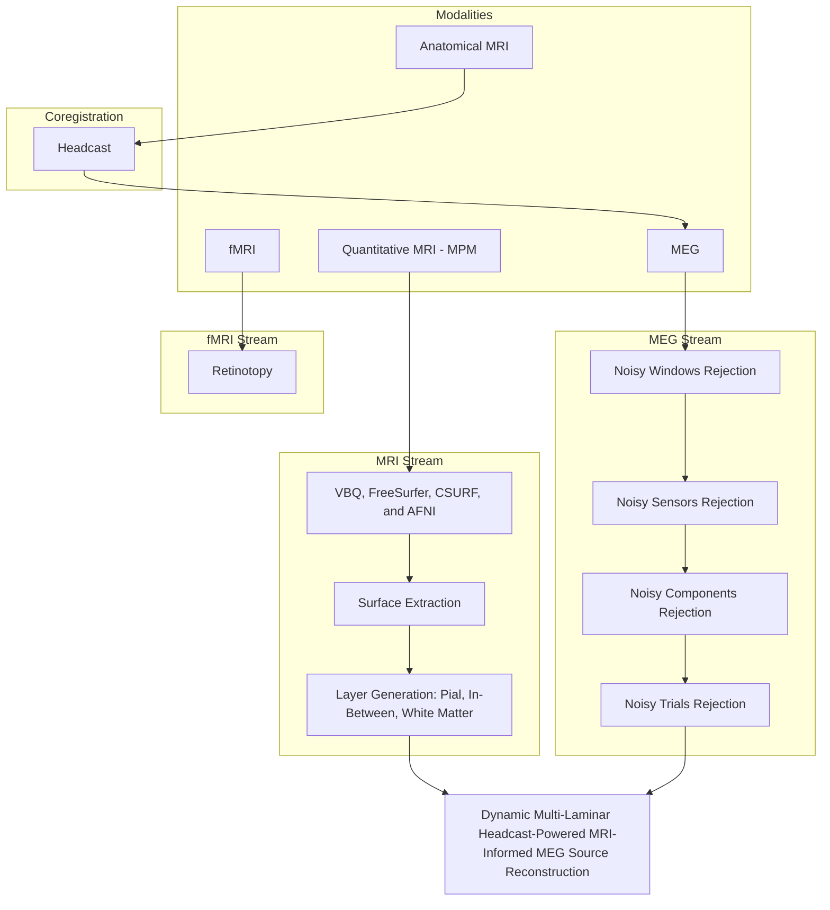

# 🧠 Dynamic Multi-Laminar Headcast-Powered MRI-Informed MEG Source Reconstruction

Tracking Information Flow in Dynamic Communication in the Brain Networks: Optimal Localization of Brain Sources using MRI-Informed MEG Source Reconstruction.

This research work was supported by ERC project [BrainDyn](https://cordis.europa.eu/project/id/716862) (PI: Dr. [Mathilde Bonnefond](https://scholar.google.com/citations?user=Xc1fz38AAAAJ&hl=en)).

## 📖 Overview
Understanding the directional flow of information in brain networks requires high spatiotemporal resolution. 
We reconstruct time-resolved laminar cortical dynamics across White Matter, In-between, and Pial surfaces using MRI-informed MEG source reconstruction. This framework enables the disentanglement and tracking of feedforward and feedback information flows by resolving activity in deep versus superficial cortical layers.

## ⚙️ Pipeline

### 🚀 Laminar Dynamics 
**Laminar specificity**, which is usefule in distinguishing between superficial (pial), middle, and deep (white matter) cortical layers dynamics to resolve feedforward vs. feedback information flow, is obtained from the following pipelines:
- **MRI Stream:**  
	- **Anatomical MRI:** It was used to create individualized 3D-printed [headcasts](https://jbonaiuto.com/tags/head-cast/) for precise co-registration and minimised head movements.
	- **Quantitative MRI (MPM):** Multi-Parameter Mapping ($R1, PD, MT, R2$) to extract cortical surfaces.
	- **Boundary Surfaces Extraction:** VBQ, FreeSurfer, CSURF, and AFNI processing are used to extract high-resolution cortical meshes for Pial and White Matter.
 	- **Layer Generation:** Intermediate laminar surfaces are derived from the extracted Pial and White Matter boundaries, incorporating neurophysiological anatomical priors.
- **MEG Stream:**
	- **Stimulation:** Visual.
	- **[Headcast](https://jbonaiuto.com/tags/head-cast/):** Individualized 3D-printed headcasts are used during acquisition to eliminate head movement and ensure precise co-registration with the MRI.
	- **Preprocessing:** A toolbox adapted from [Pipelines ILCB](https://github.com/brovelli/pipelines-ilcb), a rigorous multi-stage pipeline, allowing spatial-temporal-spectral filtering, and ensuring high signal-to-noise ratio (SNR), was developed and used to reject noisy window(s), sensor(s), ICA component(s), and trial(s).
- **Dynamic Multi-Laminar Headcast-Powered MRI-Informed MEG Source Reconstruction:** The Dynamic Imaging of Coherent Sources (DICS) beamforming method, which is based on reconstructing sources that show strong dependency (coherence) in the frequency domain, implemented in [Pipelines ILCB](https://github.com/brovelli/pipelines-ilcb) was used to reconstruct source activities.

### ⚡ Spatial Prior Selection 
A dedicated GUI-based toolbox developed to optimize source reconstruction through:
- **Interactive Prior Selection:** Manually select multiple spatial priors with real-time visualization. 
- **fMRI Integration:** Visualizes source locations (spatial priors) overlaid on fMRI activation maps to constrain the source reconstruction problem (using the parametric empirical Bayesian framework in SPM).
  

## 🔬 Tracking Information Flow in Dynamic Communication in the Brain Networks

## 📚 How to cite
* **F. Afdideh**, et al., "Tracking Information Flow in Dynamic Communication in the Brain Networks: Optimal Localization of the Brain Sources and Developing Functional Connectivity Approaches using MEG", to be published.
*	J. J. Bonaiuto, **F. Afdideh**, M. Ferez, K. Wagstyl, J. Mattout, M. Bonnefond, G. R Barnes, S. Bestmann, “Estimates of cortical column orientation improve MEG source inversion,” *[NeuroImage](https://www.sciencedirect.com/science/article/pii/S1053811920303487)*, vol. 216, p. 116862, Aug. 2020, doi: 10.1016/j.neuroimage.2020.116862.
